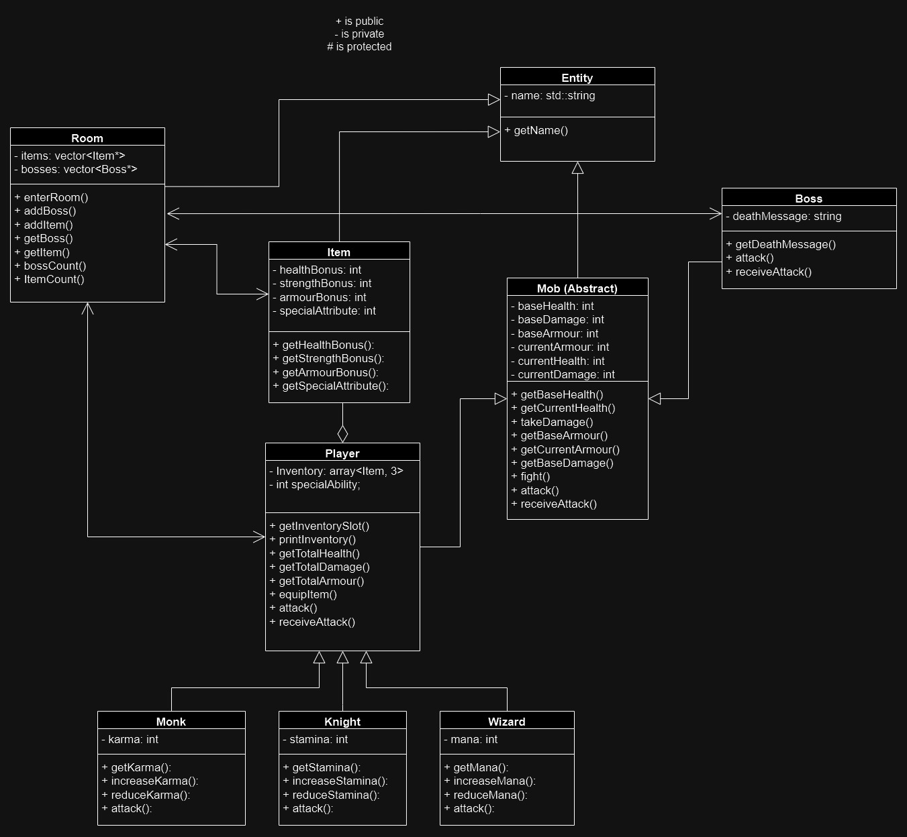

clearthecastle
========

## Introduction

A text-based RPG, written in C++. You will explore a castle, facing bosses, making decisions and progressing your character with items you find along the way.

## Building

Install the following build dependencies using your preferred package manager:

* g++
* libncurses5-dev

Use the following commands to build clearthecastle:

    $ git clone https://github.com/dinomacri/clearthecastle.git clearthecastle/
    $ cd clearthecastle/
    $ make

Then use `./run.out` to run the program.

## UML

## Changes from Project Plan

* Added Room Class
    - Inherits from Entity
    - Bosses and Items are added to Room objects for the player to encounter

* Entity Class (Abstract)
    - Removed location attribute (superseded by Room detection mechanics)

* Mob Class (Abstract)
    - Added fight() function to battle a player and boss. Utilised attack() and receiveAttack() functions.
    - Added receiveAttack() function.

* Logger Class
    - Added print(), print_debug() and print_error() functions. 
    - Avoids code repetition when printing colored text to user. 
    - Adds debug message functionality.

## Authors

* Dino Macri
* Will Lehmann
* Darcy Stephens